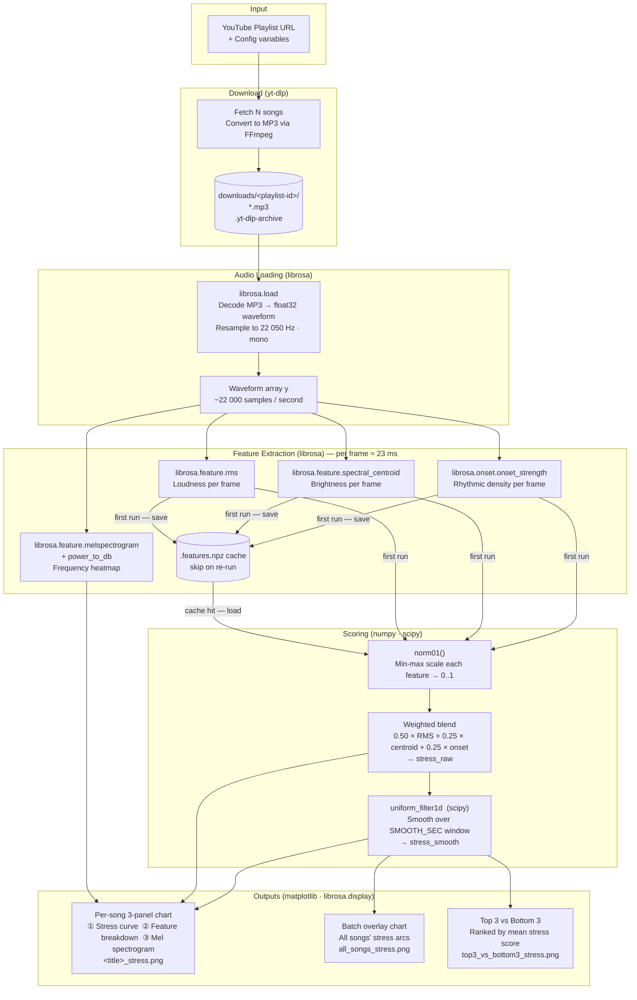

# Music Energy & Stress Analysis

Visualises the **energy arc** of songs over time — showing how a track builds from its intro, peaks at the chorus, and winds down at the outro.

Given a YouTube playlist of public-domain music, the notebook downloads the audio, extracts acoustic features with [librosa](https://librosa.org/), and produces a three-panel chart per song plus a batch overlay for the full playlist.

---

## What it produces

**Per-song chart (3 panels)**

| Panel | What you see |
|---|---|
| Top | Stress score — raw (per frame ≈ 23 ms) and smoothed (5 s window) |
| Middle | Feature breakdown: RMS energy, spectral centroid, onset strength |
| Bottom | Mel spectrogram (full frequency picture over time) |

**Batch overlay** — all songs' smoothed stress curves on one plot, useful for comparing energy arcs across tracks.

**Top 3 vs Bottom 3** — the three most intense and three calmest songs ranked by average stress score, plotted side by side.

---

## Stress score

The stress score is a weighted blend of three normalized features:

| Feature | Weight | What it captures |
|---|---|---|
| RMS energy | 50 % | Loudness / power |
| Spectral centroid | 25 % | Brightness (more treble = higher) |
| Onset strength | 25 % | Rhythmic density (attacks per second) |

---

## Data processing pipeline

The notebook follows six sequential stages for each audio file.

### 1. Configuration

```python
PLAYLIST_URL = '...'   # any YouTube playlist
N_SONGS      = 40      # how many tracks to grab
SR           = 22050   # sample rate in Hz
HOP_LENGTH   = 512     # frame step ≈ 23 ms at SR=22050
SMOOTH_SEC   = 5       # rolling-window size for the macro stress curve
```

The playlist ID is extracted from the URL with a regex and used as the download folder name, so switching playlists never overwrites earlier downloads.

### 2. Download — `yt-dlp`

`yt-dlp` fetches the first `N_SONGS` entries from the playlist, extracts the best-quality audio stream via FFmpeg, and converts it to **192 kbps MP3**.

- Files are saved as `downloads/<playlist-id>/NN_<title>.mp3`.
- A `.yt-dlp-archive` file records every downloaded video ID; re-running the cell skips already-present tracks.

### 3. Audio loading — `librosa.load`

```python
y, sr = librosa.load(path, sr=SR, mono=True)
```

The MP3 is decoded and resampled to 22 050 Hz, converted to a single mono channel, and returned as a float32 NumPy array `y`. Every subsequent computation works on this waveform.

### 4. Feature extraction — `compute_features()`

The waveform is processed in overlapping **frames** of 512 samples (~23 ms each). Three scalar values are computed per frame:

| Feature | librosa call | What it measures |
|---|---|---|
| **RMS energy** | `librosa.feature.rms` | Root-mean-square amplitude of the frame — a direct proxy for loudness. |
| **Spectral centroid** | `librosa.feature.spectral_centroid` | Weighted average frequency of the spectrum — high values mean bright, treble-heavy sound; low values mean warm or bass-heavy sound. |
| **Onset strength** | `librosa.onset.onset_strength` | Rate of change of the spectrum between frames — spikes when new notes or beats start, capturing rhythmic density. |

A **times** array (one timestamp per frame) is also created with `librosa.times_like`.

Results are persisted to a `.features.npz` file alongside the MP3. On re-runs the cache is loaded directly, skipping the computationally expensive audio analysis.

### 5. Normalization and stress score

Each feature is independently scaled to **[0, 1]** with min-max normalization:

```python
def norm01(x):
    return (x - x.min()) / (x.max() - x.min() + 1e-8)
```

The three normalized signals are then blended into a single **per-frame stress score**:

```python
stress_raw = 0.50 * norm01(rms) + 0.25 * norm01(centroid) + 0.25 * norm01(onset_env)
```

### 6. Smoothing

The raw stress curve reacts to every drum hit and micro-transient. `scipy.ndimage.uniform_filter1d` applies a **uniform (box) rolling average** over a window of `SMOOTH_SEC × SR / HOP_LENGTH` frames, producing a smooth macro arc that reveals song-level structure (intro, verse, chorus, outro).

```python
smooth_frames = int(SMOOTH_SEC * SR / HOP_LENGTH)   # e.g. 215 frames for 5 s
stress_smooth = uniform_filter1d(stress_raw, size=smooth_frames)
stress_smooth = norm01(stress_smooth)                # re-normalize after smoothing
```

### 7. Visualization

Three output charts are produced:

**Per-song chart** (`<title>_stress.png`)
- Panel 1 overlays the raw stress (thin blue) and smoothed stress (thick red) time series.
- Panel 2 shows the three normalized features as semi-transparent lines for direct comparison.
- Panel 3 renders a **mel spectrogram** — the full time-frequency energy map computed with `librosa.feature.melspectrogram` and converted to dB with `librosa.power_to_db`.

**Batch overlay** (`all_songs_stress.png`)  
All smoothed stress curves drawn on a single axis with `tab10` colors for quick inter-song comparison.

**Top 3 vs Bottom 3** (`top3_vs_bottom3_stress.png`)  
Songs are ranked by the arithmetic mean of their smoothed stress curve. The three highest-average (warm colors) and three lowest-average (cool colors) tracks are plotted on separate sub-axes.

---

## Data flow diagram



---

## Libraries

| Library | Role in this project |
|---|---|
| **[yt-dlp](https://github.com/yt-dlp/yt-dlp)** | Robust YouTube / playlist downloader. Selects the best-quality audio stream, invokes FFmpeg for format conversion, and maintains a download archive to avoid redundant fetches. |
| **[librosa](https://librosa.org/)** | The core audio-analysis library. Handles MP3 decoding and resampling (`librosa.load`), computes all three acoustic features (`rms`, `spectral_centroid`, `onset_strength`), generates the mel spectrogram, and provides display utilities. |
| **[soundfile](https://python-soundfile.readthedocs.io/)** | Backend audio I/O used by librosa to read and write WAV/FLAC/OGG files. Required even when loading MP3s because librosa delegates file reading to it. |
| **[numpy](https://numpy.org/)** | Foundation for all numerical data. Features, waveforms, and spectrograms are NumPy arrays; min-max normalization and weighted blending are vectorized array operations. |
| **[scipy](https://scipy.org/)** | Provides `scipy.ndimage.uniform_filter1d`, a fast 1-D uniform (box) filter used to smooth the per-frame stress curve into a readable macro arc. |
| **[matplotlib](https://matplotlib.org/)** | Generates all charts — multi-panel figures, time-series overlays, color-mapped spectrograms, and batch comparisons. `ticker.FuncFormatter` formats the time axis as `mm:ss`. |
| **[pathlib](https://docs.python.org/3/library/pathlib.html)** | Standard-library module for file-system paths. Used throughout to construct download directories, cache file paths, and output PNG paths in a cross-platform way. |
| **[re](https://docs.python.org/3/library/re.html)** | Standard-library regex module. Extracts the playlist ID from the URL with a single pattern so the download folder name changes automatically when the playlist changes. |

---

## Setup

```bash
git clone https://github.com/fborbon/music-analytics.git
cd music-analytics
pip install yt-dlp librosa soundfile
```

Jupyter and the scientific stack (`numpy`, `scipy`, `matplotlib`) are assumed to be installed. If not:

```bash
pip install jupyterlab numpy scipy matplotlib
```

---

## Usage

Open the notebook and run cells top to bottom:

```bash
jupyter lab music_stress_analysis.ipynb
```

1. **Install** — installs missing dependencies into the kernel
2. **Config** — set `PLAYLIST_URL`, `N_SONGS`, and `SMOOTH_SEC`
3. **Download** — fetches audio as MP3 into `downloads/<playlist-id>/`; re-running skips already-downloaded tracks
4. **Analysis** — set `FILE_IDX` to pick a song, then run feature extraction and plot cells
5. **Batch** — overlays all songs' stress curves in one chart
6. **Top / Bottom 3** — ranks every song by average stress and compares the extremes

> The notebook uses a `.yt-dlp-archive` file and `.features.npz` caches so re-runs skip completed steps automatically.

---

## Default playlist

The notebook is pre-configured with the [YouTube Audio Library — Free Public Domain Music](https://www.youtube.com/playlist?list=PLh5X0e7-mnI3lh-nb3fwZ8OcndGLfVdZX) playlist (334 tracks, CC0 / public domain). Swap `PLAYLIST_URL` for any other playlist.
